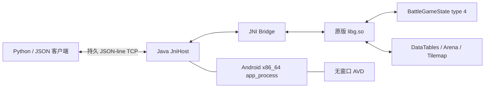

# CR-Native-Sandbox 技术文档

> 当前状态基线：游戏版本 `15.535.29`，Android runtime `150535029`，
> ABI `x86_64`，标准 1v1，文档更新于 2026-08-24。

## 1. 文档范围

本文是当前沙盒模拟器的主技术文档，只描述：

- 原版 `libg.so` 的无界面宿主；
- 标准 1v1 的创建、推进、重置和终局；
- 全卡牌、觉醒、英雄和主动技能接口；
- 外部 JSON-line 协议和 Python API；
- 原生状态观测、部署边界和验收证书；
- 版本保护、失败保护和已知边界。

本文不讨论任何学习算法、模型结构、权重、奖励塑形、采样或优化器。

全卡形态的字段级细节见附录
[`NATIVE_FULL_CARD_RUNTIME.zh-CN.md`](NATIVE_FULL_CARD_RUNTIME.zh-CN.md)。

## 2. 一句话定义

当前沙盒不是 Python 重写的《皇室战争》，而是：

> 在无窗口 Android x86_64 环境中加载冻结版原始 `libg.so`，恢复其资源、
> DataTables、BattleGameState、命令和 Tick 调用链，再通过一个严格版本化的
> JNI/JSON 适配层向 Windows 暴露可重置、可下牌、可按技能、可观测的标准
> 1v1 战斗设备。

因此，移动、寻路、挤压、索敌、攻击、投射物、伤害、圣水、卡牌循环、觉醒
循环、主动技能和塔血变化仍由原版核心执行。

## 3. 真实性边界

| 原版 `libg.so` 负责 | 宿主/适配层负责 |
| --- | --- |
| 卡牌选择解析、费用和手牌循环 | 加载 Android/Java/JNI 运行环境 |
| 地图逻辑、单位移动、寻路和碰撞 | 恢复 DataTables、地图和资源请求链 |
| 索敌、攻击、伤害、Buff、召唤物 | 构造并提交原生命令对象 |
| 建筑、法术、投射物和持续效果 | 读取公开状态并序列化为 JSON |
| 觉醒循环和英雄/冠军主动技能 | 管理持久 TCP、进程内重置和外部 API |
| 圣水倍率、塔血和原生拼血扣血 | 在无结果页面时锁存已产生的原生终局 |

适配层禁止：

- 在 Python 中补写战斗规则；
- 直接修改 HP、圣水、坐标、目标或技能状态；
- 在原生命令拒绝后伪造成功；
- 版本不匹配时继续使用旧 RVA；
- 结构读取失败后返回截断状态并假装完整。

## 4. 当前覆盖状态

| 项目 | 当前结果 |
| --- | --- |
| 标准模式 | 标准 1v1 |
| 原生逻辑频率 | 20 Hz，固定 `0.05 s`/Tick |
| 标准可见基础卡 | 122/122 通过真实下牌/施法路径 |
| 当前 DataTables 映射卡 | 152，其中 30 张隐藏或停用 |
| 觉醒形态 | 41/41 解析成功 |
| 英雄形态 | 16/16 解析成功 |
| 基础卡主动技能形态 | 8 个已入目录 |
| 英雄主动技能形态 | 16 个已入目录 |
| 主动技能命令 | 原生 command type `0x5A` 已闭环 |
| 重置 | 同一进程内 BattleState `4 → 4` |
| 公开状态协议 | `public-observe-v6` |

“通过全卡动作”表示这些卡已能被当前原生选择器、合法性检查和命令执行路径
接受；它不等于所有卡之间的组合交互都已逐对穷举。

## 5. 仓库与数据边界

| 路径 | 作用 | 写入策略 |
| --- | --- | --- |
| 当前 Git 仓库 | 宿主、JNI、Python API 和文档 | 当前工程可写 |
| `D:\Codex\E\AI ClashRoyale` | 冻结 APK、原生库和旧工程参考 | 只读来源 |
| `D:\Deepseek\cr_re` | 静态逆向、数据表和证据 | 只读来源 |
| `CR_SANDBOX_DATA` | 证书、日志和运行时缓存 | 运行时可写 |

主要外部输入：

- `base.apk` 与对应 split APK；
- `split_install_time_asset_pack.apk`；
- 冻结版 x86_64 原生库；
- 解包后的 assets；
- arena/tilemap 资源。

冻结 `libg.so` SHA-256：

```text
fa6704b83cb9c5b8eecb7b56c9671b834d636a3a6d9ac446e698e1262dc246ba
```

版本清单位于
[`bindings/runtime-150535029-x86_64.json`](../bindings/runtime-150535029-x86_64.json)。

## 6. 总体架构



Android 在这里提供 ABI、动态链接器、Java/JNI 和资源文件系统，不承担战斗
画面显示。当前宿主需要 Android x86_64 AVD，但不依赖 MuMu，也不需要启动
可见游戏客户端。

## 7. 代码组成

| 文件/目录 | 职责 |
| --- | --- |
| `android_probe/java/royale/nativehost/JniHost.java` | 生命周期、资源初始化和 JSON 服务 |
| `android_probe/native/jni_bridge.cpp` | 原生绑定、动作、技能、Tick、观测、重置和终局 |
| `native_core/client.py` | 有大小限制的持久 JSON-line 客户端 |
| `native_core/env.py` | `NativeRoyaleEnv` 高层 API |
| `native_core/worker.py` | AVD、APK、端口和 `app_process` 管理 |
| `native_core/card_catalog.py` | 当前版本全卡目录与形态映射 |
| `native_core/decks.py` | 任意八卡 Replay 构建与形态编码 |
| `native_core/deployment.py` | 对原生网格应用竞技场边界规则 |
| `scripts/start_direct_service.ps1` | 单 Slot 构建、部署、启动 |
| `scripts/stop_direct_service.ps1` | 停止单 Slot 服务 |
| `scripts/build_probe.ps1` | 构建 Java/D8 宿主 JAR |
| `scripts/build_bridge.ps1` | 构建 x86_64 JNI Bridge |

## 8. 构建产物

Java 宿主：

```powershell
.\scripts\build_probe.ps1
```

输出：`artifacts/lifecycle-probe.jar`。

JNI Bridge：

```powershell
.\scripts\build_bridge.ps1
```

输出：`artifacts/libnative_core_probe.so`。

Bridge 使用 Android NDK r27d、C++20、`x86_64-linux-android23`，并开启
`-O2 -Wall -Wextra -Werror`。`artifacts/` 是生成目录，不作为源码事实来源。

## 9. 无界面 Android 宿主

默认 AVD 为 `royale_worker_api31`，关键启动参数：

```text
-no-window
-no-audio
-no-boot-anim
-no-snapshot
-gpu swiftshader_indirect
-accel on
-memory 4096
-cores 4
```

每个 Slot 是一个独立进程：

```text
app_process /system/bin royale.nativehost.JniHost \
  /data/local/tmp/cr-native-direct-<slot> serve-direct <port>
```

每个 Slot 有独立的：

- `libg.so` 地址空间；
- BattleGameState；
- RNG；
- 远端目录；
- guest TCP 端口。

本地 JAR/Bridge 与 Android 端文件在复用前比较 SHA-256；不一致时推送到临时
文件，校验后原子改名，再重启对应 `app_process`。

## 10. 严格无 Surface 初始化

`serve-direct` 与 `probe-direct` 共享同一条直接初始化路线：

- 创建必要的 Application/Activity shell；
- 不创建 `SurfaceTexture`；
- 不创建、借用或附加 Android `Surface`；
- 不依赖可见窗口的 start/resume 绘制循环；
- 通过带版本保护的 JNI 进入原生初始化。

关键原生链：

1. `JNI_OnLoad`：`0x1458BC0`；
2. `CreateGameMain`：`0x1458E00`；
3. `GameMain::init`：`0x727050`；
4. DataTables 范围加载：`0xE74B40`；
5. Data load task：`0xCDC5B0 / 0xCDC620 / 0xCDC5A0`；
6. LoadingState：`0xCE98F0 / 0xCE9750`；
7. 地图资源请求：`0x12B6FD0 → 0x12B7320 → 0x12B7480`；
8. battlefield cache：`0xE2AF80`；
9. manager update：`0xCE7810`；
10. 外层 replay loader：`0x10B85B0`；
11. BattleGameState type：`4`；
12. battle core Tick：`0xCE2CC0`。

必须使用外层 replay loader。只调用内层 JSON loader 虽然可能得到塔实体，但
会产生错误 RNG、起手或状态图。

长期保留的资源 shim 只用于切断渲染资源变体；地图与 tilemap 仍经过原生资源
请求。所有临时 presentation patch 都先校验原字节，调用结束后恢复，且不覆盖
移动、攻击、伤害或命令函数。

## 11. 版本化 JNI 绑定

Bridge 使用 `dlopen(..., RTLD_NOLOAD)` 获取已加载模块，再通过
`dlsym("JNI_OnLoad")` 与 `dladdr` 计算基址。只有：

```text
JNI_OnLoad - libg_base == 0x1458BC0
```

才允许继续。所有绑定都按 `libg_base + frozen_rva` 解析。

主要 RVA：

| 能力 | RVA |
| --- | ---: |
| manager global | `0x1A85978` |
| manager init/update | `0xCE65B0 / 0xCE7810` |
| set replay data | `0xCE7C40` |
| outer/core update | `0xCE26D0 / 0xCE2CC0` |
| 下牌构造/执行 | `0xD8D4D0 / 0xD8D520` |
| 技能构造/执行 | `0xD8F360 / 0xD8F3C0` |
| canonical selection | `0x1048170 / 0xE85D40` |
| deployment validator | `0xD5B770` |
| account → player | `0xD4E180 / 0xD4FFE0` |
| deck → hand | `0xF96360 / 0xF8FD20` |
| ability slot/component | `0xF96D80 / 0xF925D0` |
| player elixir | `0xF93EA0` |

关键结构偏移：

| 字段 | 偏移 |
| --- | ---: |
| `manager.current_state` | `+0x20` |
| `manager.current_state_type` | `+0x30` |
| `manager.pending_state_type` | `+0x34` |
| `manager.replay_data` | `+0x78` |
| `battle_state.battle` | `+0x90` |
| `battle.tick` | `+0x60` |
| `battle.logic` | `+0xA8` |

内存读取使用 `SafeMemoryReader`；实体数、路径节点数和 Trace 大小均有硬上限。

## 12. 战斗创建与进程内重置

启动时：

1. 加载 DataTables 和地图资源；
2. 解析 bootstrap Replay；
3. 由原生 manager 创建 BattleGameState type 4；
4. 等待 logic graph、双方玩家和皇冠塔就绪；
5. 受控推进到 tick 10；
6. 开启 JSON 服务。

`reset` 不重启 Android 或重新加载 `libg.so`，而是在同一进程内执行原生
BattleState `4 → 4` 替换：

1. 解析新 Replay；
2. 暂时脱离旧 current-state slot；
3. 调用 `0xCE7C40` 设置新 Replay；
4. 恢复 current state；
5. 调用 `0xCE7810` 让 manager 执行 replacement；
6. 原生释放旧 State；
7. 完成新地图/逻辑图；
8. 等待六塔与玩家状态；
9. 根据调用参数推进到指定 warm-up tick。

当前 v6 十进程证书的冷启动均值为 14.405 秒，Replay 注入到 100 Tick 完整
观测的均值为 9.795 ms。进程内 reset 的既有压力证书均值约 11.475 ms、p95
约 26.961 ms。中局和拼血终局后的重置均有独立证书。

## 13. Replay 与全卡牌目录

Replay 模板：

- `examples/eight-card-bootstrap.json`：固定八卡基础模板；
- `examples/full-card-bootstrap.json`：全卡 Runtime 示例模板。

当前版本目录固化在 `native_core/data/live_card_catalog.json`。目录包含基础卡
映射、觉醒/英雄形态、费用和主动技能元数据；生成所需的私有逆向输入不随本
仓库分发。

每方牌组的原生条目：

```json
{"d": 26000000, "l": 10, "el": 1}
```

- `d`：基础卡 ID；
- `l`：零基等级；Python 1..16 对应原生 0..15；
- `el`：形态位掩码。

| form | `el` | 语义 |
| --- | ---: | --- |
| `base` | 0/省略 | 基础形态 |
| `evolution` | 1 | 开启原生觉醒循环 |
| `hero` | 2 | 开启英雄形态 |
| `both` | 3 | 同时启用两种能力（目录允许时） |

生成任意牌组：

```powershell
D:\AI_data\runtime\venv\Scripts\python.exe `
  scripts\build_native_replay.py `
  --deck0 "Knight@evolution,Berserker@hero,Archer,Giant,Skeletons,Musketeer,HogRider,Cannon" `
  --deck1 "Knight,Archer,Giant,Skeletons,Musketeer,HogRider,Cannon,Arrows" `
  --output D:\AI_data\cr-native-sandbox\sandbox-replay.json
```

## 14. 觉醒、英雄与“精英”语义

### 14.1 觉醒

觉醒不是按钮命令。`el & 1` 开启后，原生卡牌循环决定本次出牌解析为基础
category 26/27/28 还是觉醒 category 13。骑士验收序列为：

```text
26000000 → 26000000 → 13000000
```

### 14.2 英雄与冠军主动技能

英雄形态使用 category 203。英雄和基础冠军都通过同一原生命令 type `0x5A`
按技能。命令会检查玩家身份、存活实体、技能槽、当前状态、圣水、次数和冷却，
然后由原生逻辑扣费与触发施法。

### 14.3 精英等级

当前形态表只有 `BasicForm / EvoForm / HeroForm`，没有独立 `EliteForm`。
如果“精英”指等级，只由 `l` 控制；如果 UI 语义实际指觉醒，则走觉醒循环，
不能虚构第四种形态或额外按钮。

## 15. JSON-line 服务

Java 服务在 guest 端监听 `0.0.0.0:<port>`；Windows 默认通过 ADB forward
映射到本机 `127.0.0.1:37031+`。同一连接可连续发送多行 UTF-8 JSON，每个
请求严格返回一行 JSON。

边界：

- 请求最大 32 MiB；
- 响应最大 64 MiB；
- Trace 每次 1..64 Tick；
- Trace 响应 64 KiB..32 MiB；
- 协议 `schema_version=1`；
- TCP 启用 `TCP_NODELAY`。

客户端串行化同一连接内的请求，防止串包。只读请求在连接失败后可重连一次；
改变战斗状态的请求发生不确定 I/O 失败时禁止自动重放。

纯沙盒主要操作：

| `op` | 作用 | 是否改变状态 |
| --- | --- | --- |
| `ping` | 服务存活 | 否 |
| `status` | manager/state/battle 运行探针 | 否 |
| `observe` | 完整公开状态 | 否 |
| `observe_compact_v1` | 紧凑公开状态 | 否 |
| `reset` / `restart_replay` | 进程内 4→4 替换 | 是 |
| `load_replay` | 旧式 Replay 加载/接管入口 | 是 |
| `step` | 推进 N 次原生更新 | 是 |
| `step_trace` | 推进并返回逐 Tick 完整帧 | 是 |
| `probe_grid` | 当前手牌卡的原生 18×32 网格 | 否 |
| `act` | 下牌或 dry-run | 可选 |
| `ability` | 按存活实体的主动技能 | 是 |
| `joint_act` | 双方按固定顺序提交动作 | 是 |
| `joint_transition` | 联合动作、推进、返回下一状态 | 是 |
| `joint_transition_trace` | 联合动作与逐 Tick Trace | 是 |
| `shutdown` | 关闭服务 | 是 |

错误统一返回 `ok=false`、异常类型和文本，不降级到另一套战斗实现。

## 16. Python API

```python
from pathlib import Path
from native_core.env import NativeRoyaleEnv

with NativeRoyaleEnv(port=37031) as env:
    state = env.reset(
        Path(r"D:\AI_data\cr-native-sandbox\sandbox-replay.json"),
        warmup_steps=100,
    )
    grid = env.deployment_grid(side=0, deck_index=2, adjusted=True)
    result = env.act(side=0, deck_index=2, x=9000, y=10000)
    env.step(1)
    state = env.observe()
```

主要方法：

```text
reset / attach / restart
observe
act / probe / probe_grid
use_ability
joint_act / joint_transition / joint_transition_trace
step / trace
```

`NativeRoyaleEnv` 只做 Replay 配置、参数校验、卡牌元数据扩展、响应一致性检查
和终局字段整理，不执行战斗演算。

## 17. 原生下牌路径

外部动作：

```json
{
  "type": "play",
  "side": 0,
  "deck_index": 5,
  "x": 14500,
  "y": 9500,
  "account_hi": 1,
  "account_lo": 1,
  "dry_run": false
}
```

Bridge 流程：

1. account ID → 原生 player；
2. deck index → 当前 hand index；
3. 取得原生 hand entry；
4. 原生 allocator 分配 `0x58` 命令；
5. 调用 `DoSpellCommand` constructor；
6. 写入身份和坐标；
7. 构造并解析 canonical selection；
8. 调用 deployment validator；
9. dry-run 只返回验证；
10. 真动作以原生命令 flags=`3` 执行；
11. 通过 vtable 析构命令。

双方联合动作固定使用 `side 0 → side 1`，避免提交顺序成为隐藏随机源。

## 18. 原生主动技能路径

```python
state = env.observe()
unit = next(
    entity for entity in state["entities"]
    if entity["side"] == 0 and entity["ability_slot"] > 0
)
result = env.use_ability(side=0, entity_id=unit["entity_id"])
```

`entity_id` 是本局稳定的 5,000,000 系列 generation key。进程指针字段仅供
诊断，不能作为动作句柄。

技能结果包含：

- `accepted` / `result_code`；
- `native_mana_cost`；
- 执行前后圣水；
- 技能状态、次数、冷却和 pending 字段；
- 原生命令和 execute RVA。

已命名返回：

| 代码 | 含义 |
| ---: | --- |
| 0 | 成功 |
| 1014 / `0x3F6` | 次数用尽 |
| 1050 / `0x41A` | 圣水不足 |

未知代码保留为 `native_rejected`，没有证据前不强行命名。

## 19. Tick、比赛时间与终局

一次核心更新固定传入 `0.05f`，即 20 Hz。原生赛程：

| Tick | 阶段 | 圣水倍率 |
| --- | --- | ---: |
| `0..2399` | 常规前两分钟 | ×1 |
| `2400..3599` | 常规最后一分钟 | ×2 |
| `3600..4799` | 加时第一分钟 | ×2 |
| `4800..5999` | 加时最后一分钟 | ×3 |
| `>=6000` | 原生决胜结算 | ×3 |

`nativeStep` 先调用 core `0xCE2CC0`，再保留外层 BattleState 状态机推进并跳过
缺失的显示层。拼血阶段原生时钟可能暂停，因此 API 返回实际 completed、
tick before/after 和 episode，调用方不能把“请求次数”直接当作游戏时间。

Tick 6000 后的塔血递减由 `libg` 自己执行。无界面宿主没有结果页面，所以适配
层只观察原生皇冠塔实体并锁存结果：

- 原生 HP drain 产生新皇冠时结束；
- 同皇冠但塔血不同时，先被原生扣到 0 的一方失败；
- 完全同血并停止时导出平局；
- 普通逻辑终局、HP drain、完全同血和时钟停止使用不同原因码。

## 20. 原生观测

`observe()` 返回完整状态；`observe_compact()` 返回省略路径、碰撞和效果细节的
紧凑状态。完整观测顶层：

```text
schema_version / kind
tick / tick_after / applied_replay_tick
coherent
players / entities / effects / projectiles
entity_count / effect_count / projectile_count
rng_algorithm / rng_state
state_hash / state_hash_scope
episode
```

玩家字段：

- side、player index；
- `elixir` 与 `elixir_raw`；
- refill timer；
- next deck index；
- deck→hand；
- 当前手牌与后续 cycle。

实体字段：

- 进程内诊断指针 `id`；
- generation key / `entity_id` / creation ordinal；
- kind、side、card ID、level；
- x/y、二级坐标；
- hp/max hp、pending damage；
- behavior state；
- target 与攻击计时；
- 移动方向、碰撞累计、avoidance offset；
- path segment 与最多 115 个路径节点；
- 技能槽、状态、费用、次数、冷却和可用性。

技能按钮状态码：

| 码 | 名称 |
| ---: | --- |
| 0/1 | unknown / absent |
| 2 | ready |
| 3 | on cooldown |
| 4 | charges consumed |
| 5 | limited availability |
| 6 | disabled |
| 7 | not enough elixir |
| 8 | temporarily unavailable |
| 9 | deploying |
| 10 | pending |
| 11 | casting |
| 12 | not yet available |

公开哈希版本为 `public-observe-v6`，覆盖 Tick、规范化实体、技能字段、玩家、
路径、效果和 RNG。它用于发现状态或 schema 漂移，不是完整进程内存哈希。

实体上限为 2048，路径节点上限为 115。超过上限或关键指针不可读时直接失败。

## 21. 坐标、地图与部署边界

原生网格：

- 18 列 × 32 行；
- 单格 1000 原生坐标单位；
- 格中心 `(column*1000+500, row*1000+500)`；
- `probe_grid` 返回每行 18 个 `0/1`。

原生 validator 提供地形和卡牌约束。`native_core.deployment` 还提供一层可选的
竞技场边界修正，用于表达已实测但原生粗网格未完整表达的内容：

- 左右/上下镜像交集，消除整数半开区间非对称；
- 国王塔 4×4、公主塔 3×3 占地；
- 普通单位默认己方半场；
- 敌方公主塔被毁后，对应侧开放 5 格深口袋；
- 两塔都毁后两侧同时开放；
- 法术保留原生全场目标范围。

这层修正不是 `libg` 单个函数的输出。调用方可分别使用 `probe_grid()` 获取
原始网格，或使用 `deployment_grid(adjusted=True)` 获取修正边界。

## 22. 外部接口边界

本仓库不包含 GUI、桌面交互层或浏览器界面。所有能力都通过：

- `native_core.client.JsonLineClient`；
- `native_core.env.NativeRoyaleEnv`；
- 原始 JSON-line TCP 协议；
- PowerShell 生命周期脚本；

提供。调用方可以在独立项目中构建可视化，但不得把显示层状态写回战斗内存。

## 23. 启停与最小操作流程

启动单个服务：

```powershell
.\scripts\start_direct_service.ps1 `
  -Port 37031 `
  -Slot 0 `
  -BootstrapReplayJson D:\AI_data\cr-native-sandbox\sandbox-replay.json
```

检查：

```powershell
D:\AI_data\runtime\venv\Scripts\python.exe `
  -m native_core.client --port 37031 ping

D:\AI_data\runtime\venv\Scripts\python.exe `
  -m native_core.client --port 37031 observe
```

停止：

```powershell
.\scripts\stop_direct_service.ps1 -Port 37031 -Slot 0
```

服务日志位于 Android 端：

```text
/data/local/tmp/cr-native-direct-<slot>/service.log
```

## 24. 自动验收

### 24.1 无 Surface 冷启动

```powershell
.\scripts\accept_direct_core.ps1 -Runs 10
```

验证版本、零 Surface、DataTables、六塔、100 Tick、RNG 和公开哈希。
当前 10/10 唯一 v6 哈希为 `96598dc9028e1802`，RNG 为 `3502570521`。

### 24.2 全部标准基础卡

```powershell
D:\AI_data\runtime\venv\Scripts\python.exe `
  scripts\accept_full_card_catalog.py --port 37031
```

当前证书：122/122。

### 24.3 觉醒、英雄与主动技能

```powershell
D:\AI_data\runtime\venv\Scripts\python.exe `
  scripts\accept_native_card_forms.py --port 37031
```

当前证书：41/41 觉醒形态、16/16 英雄形态；狂战士英雄与弓箭女皇主动技能
完成扣费、次数和施法状态闭环。

### 24.4 时间、圣水与拼血

```powershell
D:\AI_data\runtime\venv\Scripts\python.exe `
  scripts\accept_match_rules.py --port 37032
```

验证 ×1/×2/×3、完全同血平局、非同血 HP drain 胜者和终局后 reset。

证书位置：

```text
D:\AI_data\cr-native-sandbox\acceptance-direct-core\
D:\AI_data\cr-native-sandbox\full-card-acceptance.json
D:\AI_data\cr-native-sandbox\card-form-acceptance.json
D:\AI_data\cr-native-sandbox\acceptance-match-rules.json
```

## 25. Fail-closed 条件

以下任一情况直接失败：

- `libg.so` 未加载或哈希/RVA 不匹配；
- manager/state/battle/logic 不可读；
- current state type 不是 4；
- BattleState vtable 与冻结版本不符；
- Replay 缺少 battle、deck 或 account；
- 卡不在手牌；
- account 无法映射到 player；
- selection 解析失败；
- 原生 deployment validator 拒绝；
- 技能实体已死亡、阵营不符或原生技能命令拒绝；
- 实体/路径/Trace 超过上限；
- response schema、完整帧或终局帧不一致；
- 远端 JAR/Bridge 哈希与本地不一致。

变更状态的 RPC 发生不确定连接错误时不自动重放，避免重复下牌或重复按技能。

## 26. 当前可严谨声称的内容

可以声称：

> 对冻结版 Android `15.535.29` x86_64 标准 1v1，当前宿主已经打通原版
> `libg.so` 的无 Surface 初始化、全标准基础卡选择、全部当前觉醒/英雄形态
> 解析、通用主动技能命令、20 Hz 推进、公开观测、原生赛程、拼血和进程内
> 重置。

不能声称：

- 另一个游戏版本可直接复用当前 RVA；
- 152 个映射条目都属于当前标准可用卡池；
- 所有卡牌两两组合与全部特殊技能场景已经穷举；
- 公开观测包含原生内存的每个私有对象；
- 修正后部署边界完全来自单一原生函数；
- 塔兵、非标准模式或未来内容已经通过当前证书。

## 27. 版本升级流程

更换 APK/`libg.so` 后必须重新完成：

1. 冻结 APK、ABI 和库哈希；
2. 重定位 `JNI_OnLoad`、关键函数和结构偏移；
3. 重新验证 DataTables 和地图资源链；
4. 重新生成全卡目录与形态 ID；
5. 重新验证 Replay、六塔、塔血、RNG 和公开哈希；
6. 重新验证下牌、技能、Grid 和 Tick；
7. 重新跑 reset、时间、圣水和终局证书；
8. 将旧证书明确标为过期。

禁止只改版本号后继续沿用旧绑定。

## 28. 文档导航

- 当前沙盒主文档：本文；
- 全卡/形态/技能附录：
  [`NATIVE_FULL_CARD_RUNTIME.zh-CN.md`](NATIVE_FULL_CARD_RUNTIME.zh-CN.md)；
- Android 生命周期探针：
  [`android_probe/README.md`](../android_probe/README.md)；
- 无 Surface 可行性原始结果：
  [`experiment-0002-results.md`](experiment-0002-results.md)；
- 历史综合路线：
  [`TECHNICAL_ROUTE.zh-CN.md`](TECHNICAL_ROUTE.zh-CN.md)。

历史综合路线包含旧八卡阶段的叙述，不再作为当前全卡沙盒能力的唯一事实源。
