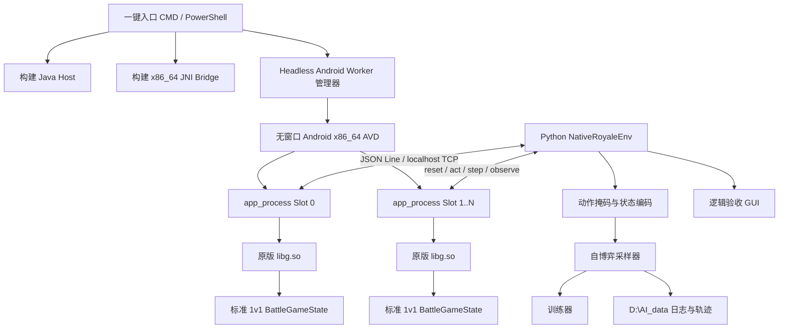

# Clash Royale 八卡原生核心技术路线

文档版本：1.0

对应代码提交基线：`a592e6b` 及其后续文档提交

冻结游戏版本：Android `150535029` / 内容版本 `15.535.29` / `x86_64`

最后核对日期：2026-08-23

## 1. 文档范围

本文描述当前项目从原版游戏文件到无界面原生战斗核心，再到 Python
自博弈接口的完整工程路线。内容包括：

- 冻结版本和八卡范围；
- 逆向证据如何转化为带版本保护的原生绑定；
- 无 Android Surface 的 `libg.so` 初始化；
- DataTables、地图、回放和标准 1v1 战斗创建；
- 原生 tick、动作、部署校验、观测、终局和进程内重置；
- 无界面 Android x86_64 Worker、并发服务和一键入口；
- Python 状态编码、动作掩码、自博弈采样和训练接口；
- GUI 人工验收、自动验收证书、已知边界和后续扩展方法。

本文**不包含**任何已训练权重、模型参数文件、检查点内容、训练收益曲线、
策略强度结论或权重分发方法。网络结构和数据接口只作为系统技术路线说明。

## 2. 目标与非目标

### 2.1 当前目标

当前目标是在本地创建一个可重复、可观测、可高速复位的八卡标准 1v1
环境。下牌落点和时机由外部控制，后续游戏演算由冻结版本的原版
`libg.so` 完成。

冻结卡组如下：

| 序号 | Card ID | 英文名 | 圣水 | 类型 |
|---:|---:|---|---:|---|
| 0 | `26000000` | Knight | 3 | 单位 |
| 1 | `26000001` | Archers | 3 | 双单位 |
| 2 | `26000003` | Giant | 5 | 单位 |
| 3 | `26000010` | Skeletons | 1 | 三单位 |
| 4 | `26000014` | Musketeer | 4 | 单位 |
| 5 | `26000021` | Hog Rider | 4 | 单位 |
| 6 | `27000000` | Cannon | 3 | 建筑 |
| 7 | `28000001` | Arrows | 3 | 法术 |

固定条件：

- 标准 1v1；
- 卡牌等级 11；
- 国王塔和公主塔等级 11；
- 基础卡形态；
- 无觉醒、无精英化、无英雄、无冠军能力；
- 双方使用同一八卡集合；
- 逻辑频率 20 Hz，每 tick 固定 `0.05 s`。

### 2.2 非目标

当前项目不尝试：

- 用 Python 重写完整战斗规则；
- 渲染原版 3D/2D 画面、音频、粒子或 HUD；
- 登录服务器、匹配线上玩家或修改线上战斗；
- 声称已经覆盖全卡、全模式或未来版本；
- 将旧版本的 RVA、结构偏移直接套用到当前版本；
- 把短时吞吐测试等同于最终训练吞吐；
- 在本文中讨论任何具体训练权重或策略实力。

## 3. 核心原则：原生规则与适配层分离

系统遵循一条硬约束：**凡是能影响对局结果的战斗演算，优先由原版
`libg.so` 执行；外部代码只负责生命周期、输入、观测、训练编码和工程调度。**

当前由原生核心负责的内容包括：

- RNG、起手、手牌和卡组循环；
- 圣水扣除与恢复速率；
- 单位/建筑/法术创建；
- 移动、路径节点、目标选择、攻击、伤害；
- 碰撞、挤压、河流和桥梁交互；
- 建筑吸引、重新索敌和目标丢失；
- 塔血、皇冠、常规时间、加时和原生拼血扣血；
- 原生命令是否接受以及每格落点是否合法。

适配层负责：

- 加载冻结文件和调用版本化 RVA；
- 绕过无界面环境中只服务于渲染的调用；
- 将原生对象序列化为稳定 JSON；
- 把双方动作按固定顺序提交；
- 将原生粗网格与已实测的部署领地/塔占地组合成训练动作掩码；
- 在缺少结果页面回调时，把原生 HP drain 已经产生的新皇冠锁存为终局；
- 把状态编码为训练张量；
- 保存日志、轨迹和运行清单。

这里最重要的区分是：**原生 HP drain 负责拼血伤害，适配层只负责发现
原生扣血已经产生结果并结束无界面对局；适配层不自行计算拼血伤害。**

## 4. 仓库与数据隔离

### 4.1 目录职责

| 位置 | 职责 | 写入策略 |
|---|---|---|
| `D:\Deepseek\CR-Native-Core` | 当前原生核心、Worker、Python 接口和文档 | 本项目可写 |
| `D:\Codex\E\AI ClashRoyale` | 旧生产沙盒和冻结运行时来源 | 只读引用 |
| `D:\Deepseek\cr_re` | 静态逆向、内存证据和工具 | 只读引用 |
| `D:\AI_data\cr-native-core` | 大型运行产物、证书、日志和训练数据 | 运行时可写 |

当前工程不会把生成文件写回旧生产沙盒或逆向证据库。JAR、JNI bridge、
Worker 脚本和 Python API 都归当前仓库所有。

### 4.2 运行时外部输入

当前机器上的只读运行时输入包括：

- `base.apk`；
- `split_config.x86_64.apk`；
- `split_install_time_asset_pack.apk`；
- 冻结版本全部 x86_64 `.so`，其中 `libg.so` 大小约 28.3 MB；
- 解包后的基础 assets；
- asset pack 中的 `locations/training_arena.csv`；
- asset pack 中的 `tilemaps/tilemap.csv`。

`libg.so` 的冻结 SHA-256 为：

```text
fa6704b83cb9c5b8eecb7b56c9671b834d636a3a6d9ac446e698e1262dc246ba
```

绑定清单位于 `bindings/runtime-150535029-x86_64.json`。只要版本、ABI、
`JNI_OnLoad` RVA 或哈希不匹配，就不应继续调用当前绑定。

## 5. 总体架构



Android 在这里是 `libg.so` 所需的 ABI、动态链接器、Java/JNI 和文件系统
宿主，不是图形模拟器。Worker 使用 `-no-window`，原生服务不创建 Surface。

## 6. 技术路线演进

项目没有直接假设“加载 `libg.so` 就能开战”，而是按证据逐层收敛：

1. **渲染分离验证**：先在创建过 Surface 的进程中销毁 Surface，再证明
   `BattleGameState` 可以继续完成 100 个原生 tick。
2. **直接构造失败定位**：单独调用 manager 构造时，在缺失资源注册表的
   路径崩溃，证明资源/DataTables 初始化必须先恢复。
3. **无 Surface 初始化**：定位并调用 `GameMain::init`、DataTables 任务链、
   地图资源请求和 battlefield cache builder。
4. **严格冷启动验收**：10 个全新进程产生同一 RNG、起手、塔血和公开状态
   哈希，证明直接路径稳定。
5. **持久 Worker**：把冷启动成本从“每局一次”变成“每 Worker 一次”。
6. **进程内 4→4 重置**：在同一 `app_process` 中替换 BattleGameState，
   避免每局重启 Android 或重新加载 DataTables。
7. **原生动作/观测闭环**：恢复手牌选择、部署验证、命令执行、tick、观测和
   双方联合动作。
8. **规则验收**：逐卡验证八卡动作；验证 3+2 分钟、×1/×2/×3 圣水、
   HP drain、胜负奖励和终局后重置。
9. **Python 自博弈层**：只在原生状态和动作 API 之上构建编码、轨迹和训练。

对应关键提交顺序：

| 提交 | 里程碑 |
|---|---|
| `13eb805` | 隔离可行性工程 |
| `27a3e19` | 原生生命周期探针 |
| `91531fb` | 无 Surface 初始化路径 |
| `9ce2099` | 严格直接核心验收通过 |
| `cf76f21` | 持久 Worker 和一键训练闭环 |
| `12d4652` | 原生逻辑验收 GUI |
| `a592e6b` | 时间、圣水阶段和拼血终局证书 |

## 7. 构建与宿主环境

### 7.1 工具链

默认工具链：

- JDK 17：`D:\Codex\toolchains\jdk-17.0.20.1+1`；
- Android SDK：`D:\Codex\toolchains\android-sdk`；
- Android NDK r27d：`D:\Codex\toolchains\android-ndk-r27d`；
- Java bytecode 转 Android DEX：D8/R8；
- Python：`D:\AI_data\runtime\venv\Scripts\python.exe`；
- Android AVD：`royale_worker_api31`；
- API/ABI：Android 31 AVD、编译最低 API 23、运行 ABI x86_64。

### 7.2 构建产物

`scripts/build_probe.ps1`：

- 编译 `android_probe/java`；
- 保留原游戏期待的 Java/JNI 类名；
- 用 D8 生成 `artifacts/lifecycle-probe.jar`。

`scripts/build_bridge.ps1`：

- 用 NDK clang++ 编译 C++20；
- 目标为 `x86_64-linux-android23`；
- 开启 `-O2 -Wall -Wextra -Werror`；
- 生成 `artifacts/libnative_core_probe.so`。

`artifacts/` 为生成目录，不进入 Git。

## 8. 无界面 Android Worker

### 8.1 AVD 启动参数

`native_core/worker.py` 使用以下关键参数启动 AVD：

```text
-no-window
-no-audio
-no-boot-anim
-no-snapshot
-gpu swiftshader_indirect
-accel on
-memory 4096
-cores 4
```

启动后检查：

- `adb get-state == device`；
- `getprop sys.boot_completed == 1`；
- Clash Royale 拆分 APK 已完整安装；
- 端口转发存在；
- 原生服务可以响应 `ping` 和 `observe`；
- 六塔、塔血、状态范围和公开哈希协议符合预期。

### 8.2 每个 Slot 的进程

每个训练 Slot 是独立 `app_process`：

```text
app_process /system/bin royale.nativehost.JniHost \
  /data/local/tmp/cr-native-direct-<slot> serve-direct <port>
```

每个 Slot 拥有：

- 独立远端目录；
- 独立 `libg.so` 地址空间；
- 独立 BattleGameState 和 RNG；
- 独立 guest TCP 端口，默认从 37031 递增；ADB/GUI 沿用 host 37031+，训练
  默认经 Emulator 直连映射使用 host 38031+；
- 共享同一个无窗口 Android AVD 和只读 APK/content。

DataTables 和 `libg` 冷初始化串行执行，战斗运行可以并行。这样避免多个软件
GPU/资源初始化同时启动造成不完整状态，同时不把每局战斗串行化。

### 8.3 部署一致性

启动脚本在复用服务前比较本地 JAR/JNI bridge 与远端文件的 SHA-256。
产物不一致时只重启对应 `app_process`，不清空 AVD。推送使用临时文件、
哈希校验和原子改名，避免半文件被加载。

## 9. 严格无 Surface 初始化

### 9.1 Java 入口

`serve-direct` 和 `probe-direct` 共享直接初始化链：

- 创建必要的 Java Application/Activity shell；
- 不创建 `SurfaceTexture`；
- 不创建、附加或借用 Android `Surface`；
- 不调用依赖可见生命周期的 start/resume 路径；
- 通过 JNI 进入带版本保护的原生初始化。

### 9.2 原生初始化链

当前冻结版本的关键链如下：

1. `JNI_OnLoad`：`0x1458BC0`；
2. `CreateGameMain`：`0x1458E00`；
3. `GameMain::init`：`0x727050`；
4. DataTables 158 项范围加载：`0xE74B40`；
5. Data load task start/pump/complete：
   `0xCDC5B0 / 0xCDC620 / 0xCDC5A0`；
6. LoadingState update/complete：`0xCE98F0 / 0xCE9750`；
7. 地图资源 request list：
   `0x12B6FD0 -> 0x12B7320 -> 0x12B7480`；
8. battlefield cache：`0xE2AF80`；
9. manager update：`0xCE7810`；
10. 外层 replay loader：`0x10B85B0`；
11. BattleGameState type：`4`；
12. 核心 tick：`0xCE2CC0`。

必须调用外层 replay loader。只调用内层 JSON loader 虽然能得到塔实体，但会
产生错误 RNG、起手和状态哈希。

### 9.3 渲染边界

长期保留的进程内 shim 只有 resource-variant dispatcher
`0x137F220`：渲染资源变体 1/2 返回空资源；逻辑地图和 tilemap 仍通过原生
资源请求链加载。

其余绕过都是：

- 仅针对已确认的 presentation-only 调用点；
- 调用前验证原始字节；
- 临时写入；
- 目标原生调用结束后立即恢复；
- 不修改 `LogicBattle`、命令、移动、攻击或伤害函数。

## 10. 版本化 JNI 绑定

### 10.1 地址解析

JNI bridge 通过 `dlopen(..., RTLD_NOLOAD)` 获取已加载 `libg.so`，再用
`dlsym("JNI_OnLoad")` 和 `dladdr` 求模块基址。只有
`JNI_OnLoad - base == 0x1458BC0` 时才允许继续。

所有函数地址均按：

```text
absolute_address = libg_base + frozen_rva
```

解析。关键 RVA：

| 能力 | RVA |
|---|---:|
| manager global | `0x1A85978` |
| manager init | `0xCE65B0` |
| manager update | `0xCE7810` |
| set replay data | `0xCE7C40` |
| BattleState outer update | `0xCE26D0` |
| Battle core update | `0xCE2CC0` |
| skip core/presentation gate | `0x1A85930` |
| command constructor | `0xD8D4D0` |
| command execute | `0xD8D520` |
| canonical selection builder | `0x1048170` |
| canonical selection resolver | `0xE85D40` |
| deployment validator | `0xD5B770` |
| account→player index | `0xD4E180` |
| player by index | `0xD4FFE0` |
| deck index→hand index | `0xF96360` |
| hand entry | `0xF8FD20` |
| player elixir | `0xF93EA0` |
| next deck index | `0xF98120` |

### 10.2 关键结构字段

| 对象字段 | 偏移 |
|---|---:|
| manager.current_state | `+0x20` |
| manager.current_state_type | `+0x30` |
| manager.pending_state_type | `+0x34` |
| manager.replay_data | `+0x78` |
| battle_state.battle | `+0x90` |
| battle.tick | `+0x60` |
| battle.logic | `+0xA8` |

读取使用带 `/proc/self/maps` 范围检查的 `SafeMemoryReader`。实体数量、路径
节点数和 trace 大小均设置硬上限，防止结构漂移被误当成正常数据。

## 11. 标准 1v1 创建

bootstrap replay 位于 `examples/eight-card-bootstrap.json`，包含：

- `rndSeed`；
- 标准 game mode、arena 和 location；
- 双方八卡及等级；
- 双方 account ID、名称和塔等级；
- 空命令列表。

服务启动时：

1. DataTables 和地图加载完成；
2. `nativeLoadReplay` 解析 bootstrap JSON；
3. `nativePumpManager` 完成 BattleGameState 外层图创建；
4. 等待 battle type 4、logic graph 和地图就绪；
5. 原生受控推进到 tick 10；
6. 开启 JSON-line 服务。

训练 reset 会继续推进到 tick 100，因为该冻结版本在 tick 100 开放部署。

标准开局必须满足：

- 6 个皇冠塔实体；
- 国王塔 `4824/4824`；
- 公主塔 `3052/3052`；
- 双方玩家、手牌、循环和圣水可读；
- battle phase 4；
- 状态 coherent；
- `state_hash_scope == public-observe-v6`。

## 12. JSON-line 外部协议

服务绑定 Android guest 的 `127.0.0.1:<port>`，通过 `adb forward` 暴露到
Windows host。同一持久 TCP 连接可以连续传入多行 UTF-8 JSON，每个请求严格
返回一行 JSON。Python 客户端用连接内锁保证不串包；只读请求断线后允许自动
重连一次，变更状态的请求在不确定失败后禁止重放。两端均启用`TCP_NODELAY`。

边界：

- 请求最大 32 MiB；
- 普通响应最大 64 MiB；
- trace 每次最多 64 tick；
- trace 响应上限 32 MiB；
- schema version 当前为 1。

主要操作：

| op | 作用 | 是否改变战斗 |
|---|---|---|
| `ping` | 服务存活检查 | 否 |
| `status` | manager、state、battle 运行时探针 | 否 |
| `observe` | 完整公开原生状态 | 否 |
| `observe_train_v1` | 训练所需紧凑状态 | 否 |
| `reset` | 新 seed/replay 的进程内 4→4 替换 | 是 |
| `step` | 推进 N 次 50 ms 原生核心更新 | 是 |
| `step_trace` | 推进并返回每个 tick 的完整帧 | 是 |
| `probe_grid` | 当前手牌某卡的 18×32 原生落点校验 | 否 |
| `act` | 单方原生下牌，可 dry-run | 可选 |
| `joint_act` | 双方按固定顺序提交动作 | 是 |
| `joint_transition` | 联合动作 + step + next observe | 是 |
| `joint_training_transition_v1` | 联合动作 + step + 紧凑状态 | 是 |
| `joint_transition_trace` | 联合动作 + 多 tick 全帧 trace | 是 |
| `shutdown` | 关闭对应服务进程 | 是 |

所有错误返回 `ok=false`、异常类型和错误文本，不把失败静默降级为另一个
初始化模式。

## 13. 原生动作路径

一次动作包含：

```json
{
  "side": 0,
  "deck_index": 5,
  "x": 14500,
  "y": 9500,
  "account_hi": 1,
  "account_lo": 1,
  "dry_run": false
}
```

JNI bridge 的动作流程：

1. 用 account ID 查找原生 player index；
2. 读取 player 对象；
3. 把 deck index 映射到当前 hand index；
4. 取得原生 hand entry；
5. 用原生 allocator 分配 `0x58` 字节命令对象；
6. 调用 `DoSpellCommand` 构造函数；
7. 写入 account、坐标和选择字段；
8. 调用原生 canonical selection builder；
9. 调用原生 selection resolver；
10. 调用原生 deployment validator；
11. dry-run 只返回验证结果；
12. 真动作使用原生命令队列同样的 flags=`3` 执行；
13. 调用对象 vtable 析构并释放。

动作结果包含：

- 是否接受；
- result code；
- tick、side、deck/hand index；
- 坐标；
- placement code/reason；
- packed selection；
- command/execute RVA 证据。

双方联合动作固定按 `side 0 -> side 1` 执行，避免并发提交顺序成为隐藏的
非确定性来源。

## 14. 部署网格与动作掩码

### 14.1 原生粗网格

训练动作网格固定为：

- 宽 18 格；
- 高 32 格；
- 每格 1000 原生坐标单位；
- 格中心为 `(column*1000+500, row*1000+500)`。

`probe_grid` 对当前手牌的原生 selection 调用 `0xD5B770`，逐格返回
`0/1`。法术如 Arrows 的原生目标网格可以覆盖全场。

### 14.2 最终训练掩码

当前冻结 replay 的原生 validator 输出包含地形/卡牌约束，但部署领地和塔
占地还必须结合实机观测规则。`training/schema.py::deployment_mask` 负责：

1. 对粗网格做左右、上下四向镜像交集，消除整数半开区间造成的非对称；
2. 删除国王塔 4×4、公主塔 3×3 占地；
3. 普通情况下只开放己方半场；
4. 敌方左公主塔被毁后，开放左侧 5 格深口袋；
5. 敌方右公主塔被毁后，开放右侧 5 格深口袋；
6. 两塔都毁后，两侧口袋同时开放；
7. 法术保留原生全场目标掩码；
8. tick < 100、圣水不足、卡不在手或无合法格时禁用该卡；
9. 直接调用 `libg` 的 `0xD50CD0/0xD503D0` 命令门；原生已经判定比赛、
   但结果动画尚未进入宿主终局的 tick 内只允许 WAIT。

这部分属于**适配层规则**，不是对 `libg` 内部算法的声明。GUI 可以在“原始
libg 掩码”和“训练最终掩码”之间切换，用于持续人工核对。

动作空间为：

- card action：`wait + 当前四张手牌`，共 5 类；
- position action：选中手牌对应的 `18×32=576` 个格；
- 红方状态和坐标旋转 180° 后送入同一策略视角。

## 15. 原生 tick 路径

每次 `nativeStep`：

1. 验证当前 state type 为 4；
2. 验证 vtable slot 13 指向冻结版本 BattleState update；
3. 调用原生 battle core `0xCE2CC0(state, 0.05f)` 一次；
4. 读取最新 tick、实体、塔和逻辑状态；
5. 在非终局阶段临时打开 `0x1A85930` gate；
6. 调用外层 `0xCE26D0`，保留状态机推进，同时跳过重复 core 和缺失 HUD；
7. 检查 state/battle 是否被原生替换；
8. 检查原生逻辑 substate 和终局条件；
9. 返回实际 completed、tick before/after 和 episode。

因此“一次 step 调用”与“tick 一定增加一次”不是永久等价关系。浮点累加帧、
拼血和终局阶段可能出现 update 已调用但 tick 暂停。训练循环使用观测 tick 和
episode 终局字段，而不是假设请求次数就是游戏时间。

## 16. 时间、圣水与终局

### 16.1 冻结标准赛程

对原生圣水恢复量和 tick 边界的独立实测结果：

| tick 范围 | 阶段 | 剩余计时 | 圣水倍率 |
|---|---|---|---:|
| `0..2399` | 常规前两分钟 | 3:00 → 1:00 | ×1 |
| `2400..3599` | 常规最后一分钟 | 1:00 → 0:00 | ×2 |
| `3600..4799` | 加时第一分钟 | 2:00 → 1:00 | ×2 |
| `4800..5999` | 加时最后一分钟 | 1:00 → 0:00 | ×3 |
| `>=6000` | 原生决胜结算 | 0:00 | ×3 |

GUI 在 tick 100 显示 `2:55`，因为原生开局前 100 tick 已包含在三分钟总时钟
中。训练在 tick 100 才开放动作，不把它重新定义为 3:00。

### 16.2 拼血与终局锁存

tick 6000 后，原生 core 自己执行 HP drain。无界面环境没有原结果页面帧，
因此适配层记录进入拼血前双方已有皇冠数，并监控原生塔实体：

- 某方因 HP drain 新增皇冠：锁存终局；
- 皇冠不同：皇冠多的一方获胜；
- 原生 drain 完全对称并停止时：导出平局；
- 奖励为零和形式：胜者 `+1`，败者 `-1`，平局双方 `0`；
- 终局原因区分 `native_tiebreak_hp_drain`、
  `native_tiebreak_exact_draw`、普通原生逻辑终局等。

实测不对称场景中，红方公主塔先受到 75 点原生法术塔伤，tick 6000 后开始
原生 drain，tick 6168 该塔归零，输出蓝方胜、皇冠 `1:0`、奖励 `[1,-1]`。
完全同血场景在原生时钟停止后输出平局。

## 17. 原生观测协议

### 17.1 顶层

公开状态主要字段：

- `schema_version`、`kind`；
- `tick`、`tick_after`、`applied_replay_tick`；
- `coherent`；
- `entity_count`；
- `effect_count`、`projectile_count`；
- `rng_algorithm`、`rng_state`；
- `state_hash`、`state_hash_scope`；
- `players`；
- `entities`；
- `effects` / `projectiles`；
- `episode`。

### 17.2 玩家

每方公开：

- side 和原生 player index；
- 整数圣水与 `elixir_raw`；
- refill timer；
- next deck index；
- deck→hand 映射；
- 当前四张 hand deck indices；
- 后续 cycle deck indices。

Python env 根据冻结 replay 的 deck 表把 deck index 扩展为 card ID、等级和名称。

### 17.3 实体

每个观测实体包含可用的：

- 稳定到本局的指针 ID、generation key、creation ordinal；
- category、kind、side、card ID、level；
- x/y 和二级坐标；
- hp/max hp、pending damage；
- behavior state；
- target 及目标历史坐标；
- attack progress/load timer；
- movement direction；
- collision accumulator/count；
- avoidance offset；
- path segment direction；
- path node consumed 和最多 115 个路径节点。

观测上限为 2048 个实体。超过上限、结构指针不可读或关键范围不合理时应报错，
不能截断后继续训练。

### 17.4 效果与投射物

效果观测区分已识别 projectile 和未分类 effect，记录位置、side、card/source、
目标和可用计时字段。`effects_classified` 明确指示是否所有效果都已分类，避免
训练层误以为未观测对象不存在。

### 17.5 公开哈希

`state_hash_scope = public-observe-v6`。哈希覆盖公开 tick、实体、技能槽/次数/
冷却、玩家、路径、效果、RNG 等规范化字段，用于：

- 同 seed 重置确定性；
- 冷启动一致性；
- 轨迹复现；
- 版本或观测 schema 漂移检测。

它不是完整内存哈希，也不包含所有私有/渲染状态。

## 18. 进程内重置

### 18.1 为什么不能每局重启

冷启动平均约 13 秒，而一次进程内 reset 平均约 11 ms。若每局重启
`app_process` 或 Android，训练吞吐会被生命周期成本主导。

### 18.2 4→4 替换流程

`reset` 的目标是在当前 BattleGameState(type 4) 内创建新的
BattleGameState(type 4)：

1. 解析新 replay JSON；
2. 记录当前 BattleState；
3. 临时从 manager current-state slot 脱离当前 state；
4. 调用原生 `CE7C40` 设置 replay，使其尾部选择 pending type 4；
5. 恢复 current state；
6. 调用 `CE7810` 执行原生 4→4 replacement；
7. 原生 manager 通过自身 vtable 释放旧 state；
8. Java 调用 `nativePumpManager` 完成新 replay/map 图；
9. 等待六塔和玩家状态；
10. 推进到 tick 10，训练 env 再推进到 tick 100。

不能强行先跳 HomeState。无 Surface 环境中该路径会触发 presentation controller
空指针。也不能在 JNI reset 内运行 renderer-facing BattleGameState frame；新图
应由严格 direct manager pump 完成。

### 18.3 已通过的 reset 门槛

- 200 次同 seed：单一公开哈希；
- 后续 1000 次同 seed：单一公开哈希；
- 1000 次平均 `11.475 ms`，p95 `26.961 ms`；
- RSS 在压力段前后没有单调增长；
- 中局 reset 通过；
- 拼血终局后 reset 回 tick 100、六塔通过。

## 19. Python 环境层

`native_core/client.py` 负责有大小限制的 JSON-line RPC。

`native_core/env.py::NativeRoyaleEnv` 提供：

- `reset(replay, warmup_steps=100)`；
- `observe()`；
- `act()` / `probe()`；
- `probe_grid()`；
- `step()` / `trace()`；
- `joint_act()`；
- `joint_transition()`；
- `joint_transition_trace()`；
- Gym 风格 terminal/reward 返回；
- 终局 JSON 导出。

env 不实现战斗演算。它只做：

- 类型/范围校验；
- replay deck/account 配置；
- hand index→card 元数据扩展；
- episode 中 crowns/rewards 的 side 映射；
- trace schema 和响应完整性检查。

## 20. 训练数据接口（不含权重）

### 20.1 状态编码

`training/schema.py` 把原生公开状态编码为：

- `10×32×18` spatial grid；
- 64 维公开 scalar；
- 33 维 critic-only privileged vector。

空间通道表达双方塔、单位、建筑、卡牌类别和行为强度。红方视角旋转 180°，
双方共享同一套视角定义。

公开 scalar 包括：

- tick 比例；
- 自己圣水；
- 双方实体数量；
- 双方塔血；
- 当前四张手牌 one-hot；
- 上一时刻双方公开下牌事件和坐标。

Actor 只接收公开状态。Critic-only 输入包含敌方精确圣水和手牌，不能泄漏给
Actor。代码把两条路径分开，防止训练时的信息优势进入部署策略。

### 20.2 策略接口

当前策略接口由：

- 卷积空间编码；
- 公开 scalar 编码；
- 单层 recurrent state；
- 5 类 card head；
- 每张手牌 576 格 position head；
- 独立 privileged critic 分支；
- value head；

组成。本文只记录接口结构，不包含任何参数权重。

### 20.3 自博弈时序

每一决策 tick：

1. 从同一原生状态编码双方视角；
2. 为双方读取当前手牌的原生网格；
3. 构建 card/position masks；
4. 汇总所有 active Worker 的双方视角，执行一次全局 batch 推理；
5. 生成一个 canonical `joint_transition`；
6. 原生按 side 0、side 1 顺序执行；
7. 原生推进一个 tick；
8. 读取 next observation 和 episode；
9. 保存双方零和轨迹。

### 20.4 奖励接口

终局奖励由原生胜负导出：

- 胜：`+1`；
- 负：`-1`；
- 平：`0`。

Self-Play v0.1 冻结使用严格反对称的塔血势函数：

\[
r_t=r_{terminal}+0.2\left(\gamma\Phi(s_{t+1})-\Phi(s_t)\right)
\]

其中 `gamma=0.99995`，`Phi` 是双方三座皇冠塔“剩余总 HP / 最大总 HP”之差；
终局后的吸收状态势能固定为 0。势函数明确不读取圣水、击杀、过河、单位伤害、
存活单位价值或其他可能诱发 reward hacking 的信号。这样保留原生胜负为唯一
终局目标，同时只提供与最终拆塔目标同向的稠密学习信号。

### 20.5 训练器边界

当前训练器消费完整 AgentTrajectory，计算 GAE 并执行 recurrent PPO 更新。
数据切分保留 burn-in 和固定长度序列。此处的职责是优化策略，不改变任何
原生战斗状态或规则。

本文刻意不记录具体权重、检查点内容、训练结果或当前策略实力。

## 21. 并发与性能结构

### 21.1 并发模型

正式 v0.1 配置：

- 2 个无窗口 Android AVD；
- 每个 AVD 4 个独立 `app_process/libg` Worker，共 8 Worker；
- 每个 Worker 同时只运行 1 场；
- Python 用 vector collector 汇总 `2×Worker` 视角并并行等待 Worker RPC；
- CUDA 侧按活动 batch shape 复用 CUDA Graph；
- 同一轮收集完成后统一更新。

理论上 Worker 配置允许 1..8，但可用数量受主机 CPU、AVD 内存、单进程 RSS、
JSON 序列化和 GPU 推理共同限制。不能只按原生 tick microbenchmark 推算全流程
对局吞吐。

### 21.2 已测性能

- 冷进程平均约 `13.095 s`；
- replay 注入到 100 tick 观测平均约 `13.126 ms`；
- 该短路径约 `7,618 validated tick/s`；
- 进程内 reset 平均约 `11.475 ms`；
- 双 Worker 的短采样/更新闭环已通过。
- 第一阶段固定2×1000步真实闭环约 `289–291 environment steps/s`；
- 第一阶段2 Worker、4场完整终局环境采样约 `211.96 environment steps/s`；
- 第二阶段4 Worker、直连和 CUDA Graph 的完整终局为 `368.28 steps/s`，
  含 PPO 为 `305.76 steps/s`，约 `187.76 episodes/hour`；
- 第二阶段固定短跑受主机功耗/调度影响约 `380–535 steps/s`，因此不把峰值
  当作持续吞吐承诺；
- 正式多AVD Sweep推荐2 AVD / 8 Worker / 最大batch 16：环境`526.99
  steps/s`、含PPO`393.22 steps/s`；3 AVD只再提升6.1%且系统内存余量降至
  约36 MiB，因此按停止条件未运行4 AVD；
- 完整阶段profile见 `docs/throughput-optimization-20260823.md`。
- 并发Sweep见 `docs/TRAINING_CONCURRENCY_SCALING.zh-CN.md`。

这些数字分别测量不同层次，不应互相替代：训练每 tick 还包括完整观测 JSON、
掩码、推理、轨迹保存和优化器更新。

## 22. GUI 人工验收

`GAME_LOGIC_GUI.cmd` 启动原生逻辑验收 GUI。它连接同一 JSON API，不拥有另一
套沙盒逻辑。

GUI 支持：

- seed 重置；
- `+1/+20/+200 tick`；
- 自动推进和推进批量；
- 红蓝双方切换；
- 当前手牌选择；
- 点击落点、原生 dry-run 和真实下牌；
- 原始 libg 网格/最终训练掩码切换；
- 18×32 坐标、河流和桥；
- 六塔及 4×4/3×3 占地；
- 当前目标连线；
- 原生路径节点；
- HP、坐标、behavior state；
- attack timer、collision accumulator/count 等实体字段；
- 实时比赛倒计时和圣水倍率；
- state hash、RNG、双方圣水、实体数；
- 终局皇冠、胜者和奖励；
- JSON 快照导出到 `D:\AI_data\cr-native-core\gui-sessions`。

GUI 是验收工具，不进入训练主循环。训练启动前必须关闭 GUI，避免两个 host
客户端同时操作同一个端口和 BattleGameState。

## 23. 自动验收体系

### 23.1 严格直接核心

命令：

```powershell
.\scripts\accept_direct_core.ps1 -Runs 10
```

检查：

- 零 Surface；
- 158 项 DataTables 完成；
- 六塔和标准塔血；
- tick 0→100；
- RNG、起手、循环和公开哈希一致；
- 10 个全新进程唯一哈希 `5594aa3c81dc52fa`。

证书：

```text
D:\AI_data\cr-native-core\acceptance-direct-core\
```

### 23.2 八卡动作

命令：

```powershell
D:\AI_data\runtime\venv\Scripts\python.exe scripts\accept_eight_cards.py
```

检查每张卡：

- 在当前手牌；
- 原生网格有合法点；
- command accepted；
- 原生圣水下降；
- 原生手牌轮转；
- 单位/建筑实体数或 Arrows effect 数符合卡牌行为。

证书：

```text
D:\AI_data\cr-native-core\acceptance-eight-cards.json
```

### 23.3 比赛规则

命令（建议使用独立第二 Worker）：

```powershell
D:\AI_data\runtime\venv\Scripts\python.exe `
  scripts\accept_match_rules.py --port 37032
```

检查：

- tick 100 的 ×1 圣水恢复；
- tick 2400 的 ×2；
- tick 4800 的 ×3；
- 完全同血的原生拼血/平局锁存；
- 同皇冠数但塔血不同时的 HP drain 胜者；
- `[+1,-1]` 奖励；
- 终局后 4→4 reset。

证书：

```text
D:\AI_data\cr-native-core\acceptance-match-rules.json
```

### 23.4 端到端接口

`SMOKE_TEST_TRAINING.cmd` 验证：

- 构建；
- 冷启动或复用 Worker；
- 原生 reset；
- 原生采样；
- 状态编码；
- 一次完整优化更新；
- 运行产物可重新读取。

这里验证的是工程闭环，不代表策略已经训练完成。

## 24. 数据与产物

所有可变大数据写入 `D:\AI_data\cr-native-core`。主要目录：

| 路径 | 内容 |
|---|---|
| `acceptance-direct-core` | 无 Surface 冷启动证据 |
| `acceptance-eight-cards.json` | 八卡原生动作证书 |
| `acceptance-match-rules.json` | 时间/圣水/拼血证书 |
| `worker` | runtime asset overlay 和 Worker 运行数据 |
| `android/logs` | AVD 和服务日志 |
| `gui-sessions` | GUI 导出状态/动作 |
| `training/runs` | run manifest、事件和轨迹 |
| `training/latest_run.json` | 最新运行的原子指针 |

训练权重和检查点属于运行产物，不进入本文，也不提交到源码仓库。

## 25. 一键入口与运维

### 25.1 开始训练

```text
START_TRAINING.cmd
```

或：

```powershell
.\scripts\start_training.ps1
```

执行顺序：构建 → 启动/检查 AVD → 检查 APK → 部署/检查服务 → 原生开局
attestation → 自博弈。

### 25.2 冒烟验收

```text
SMOKE_TEST_TRAINING.cmd
```

### 25.3 GUI

```text
GAME_LOGIC_GUI.cmd
```

### 25.4 服务管理

```powershell
D:\AI_data\runtime\venv\Scripts\python.exe -m native_core.worker status --workers 4
D:\AI_data\runtime\venv\Scripts\python.exe -m native_core.worker stop --workers 4
D:\AI_data\runtime\venv\Scripts\python.exe -m native_core.worker stop --workers 4 --stop-vm
```

## 26. 失败保护

系统当前的主要 fail-closed 条件：

- `libg` 未加载；
- `JNI_OnLoad` RVA 不匹配；
- manager/state/battle/logic 指针不可读；
- current state type 不是 4；
- state update vtable 不匹配冻结 RVA；
- replay 缺少 battle 或 deck；
- card 不在当前手牌；
- account 无法映射到 player；
- selection 无法解析；
- deployment validator 拒绝；
- 实体数量或路径节点超过上限；
- trace schema/version/大小不符；
- opening 不是六塔或塔血不符；
- 远端产物哈希与本地不一致；
- terminal frame 与 episode 不一致。

失败时禁止回退到 Python 战斗逻辑，也禁止把旧 state 当成新一局继续训练。

## 27. 已知边界与风险

### 27.1 已证明的范围

目前可以严谨表述为：

> 对冻结 Android 15.535.29 x86_64、标准 1v1、等级 11、八张基础卡的已覆盖
> 路径，战斗推进、卡牌动作、圣水、手牌循环、路径/目标/碰撞/攻击、塔血、
> 时间和拼血由原版 `libg.so` 执行；外部层提供版本化生命周期、观测、动作掩码
> 和无界面终局锁存。

### 27.2 仍不能声称的范围

- 不能声称全卡牌 100% 覆盖；
- 不能声称觉醒、精英、英雄、冠军、塔兵或特殊模式已经覆盖；
- 不能声称另一个游戏版本可直接使用当前 RVA；
- 不能声称公开观测包含原生内存中的所有隐藏对象；
- 不能把最终训练部署掩码说成完全由一个 libg 函数返回；
- 不能把无界面终局锁存说成原版结果页面逻辑；
- 不能用短 tick benchmark 预测最终策略训练速度；
- 不能根据一次 GUI 对局推断长期训练不存在状态漂移。

### 27.3 当前最需要持续监控的点

1. 最终部署掩码与实机部署领地的一致性；
2. 塔毁后左右口袋开放边界；
3. 高实体量下 2048 上限是否足够；
4. 未分类 effect 是否影响策略观测；
5. 长时间多 Worker 下 RSS、句柄和端口稳定性；
6. 所有终局类型能否 reset 而无状态残留；
7. 训练中原生合法掩码动作的拒绝率；
8. seed 重放时公开哈希是否可复现。

## 28. 版本升级与扩卡方法

### 28.1 升级游戏版本

每次升级必须重新完成：

1. APK/libg 哈希冻结；
2. `JNI_OnLoad` 和关键 RVA 静态映射；
3. 结构偏移和 vtable 验证；
4. DataTables/资源链验证；
5. 六塔、塔血、RNG、起手和 hash 基线；
6. 动作构造/执行/部署验证；
7. 4→4 reset 压力测试；
8. 时间、圣水和终局证书；
9. 旧证书失效标记。

禁止仅修改版本号后沿用绑定。

### 28.2 增加卡牌

新增卡牌不能只把 Card ID 写入列表。每张卡至少需要：

1. 冻结 card/content 数据；
2. 当前手牌 selection 可解析；
3. 原生部署网格/法术目标网格；
4. 圣水、手牌轮转和实体/effect 证据；
5. 特有组件是否进入观测；
6. 行为、投射物、召唤物、持续效果和终局影响；
7. 单卡自动证书；
8. 与其他卡的交互场景；
9. 状态编码扩展和 schema version 变更；
10. 回归当前八卡证书。

### 28.3 扩大并发

扩大 Worker 数量前应分别测量：

- AVD 内存；
- 单 `app_process` RSS；
- CPU core saturation；
- JNI/JSON 开销；
- GPU batch 利用率；
- reset p50/p95/p99；
- 每小时有效完整对局；
- 失败/重启率。

并发扩展不能改变同一对局内双方动作的 canonical 顺序。

## 29. 源码导航

| 文件/目录 | 作用 |
|---|---|
| `android_probe/java/royale/nativehost/JniHost.java` | Java 生命周期和 JSON 服务 |
| `android_probe/native/jni_bridge.cpp` | 原生绑定、动作、tick、观测、reset、终局 |
| `bindings/runtime-150535029-x86_64.json` | 冻结绑定清单 |
| `examples/eight-card-bootstrap.json` | 标准八卡 replay 模板 |
| `native_core/client.py` | JSON-line 客户端 |
| `native_core/env.py` | Python 原生环境 facade |
| `native_core/worker.py` | AVD、APK、服务和并发 Slot 管理 |
| `native_core/gui.py` | 游戏逻辑验收 GUI |
| `training/schema.py` | 卡表、部署掩码、状态编码、奖励 schema |
| `training/model.py` | 策略/价值网络接口，不含权重 |
| `training/rollout.py` | 双方同 tick 自博弈采样 |
| `training/vector_rollout.py` | 跨 Worker 全局 batch 自博弈采样 |
| `training/ppo.py` | recurrent PPO 更新器 |
| `training/train.py` | 运行编排和持久化 |
| `scripts/start_direct_service.ps1` | 单 Slot 部署和启动 |
| `scripts/start_training.ps1` | 一键训练入口 |
| `scripts/start_logic_gui.ps1` | GUI 启动入口 |
| `scripts/accept_direct_core.ps1` | 直接核心十进程证书 |
| `scripts/accept_eight_cards.py` | 八卡动作证书 |
| `scripts/accept_match_rules.py` | 时间、圣水、拼血证书 |
| `scripts/accept_training_fast_path.py` | compact/vector 语义差分证书 |

## 30. 结论

当前路线不是继续给 Python 沙盒补战斗规则，而是把冻结版原生 `libg.so` 变成
一个带版本保护、可复位、可观测、可并发的本地战斗设备。Python 只在稳定 ABI
之上做动作选择、状态编码、轨迹采集和学习。

这条路线已经完成八卡训练所需的基础闭环：严格无 Surface 冷启动、标准 1v1、
原生动作、逐 tick 演算、完整公开观测、时间/圣水/拼血终局、进程内 reset、
双 Worker、自博弈接口和人工/自动验收。

后续工作的正确方式是扩大证据覆盖和工程吞吐，而不是把未验证的原生行为重新
写成 Python 规则。每次扩卡、扩模式或升级版本，都必须重新通过版本化证书。
